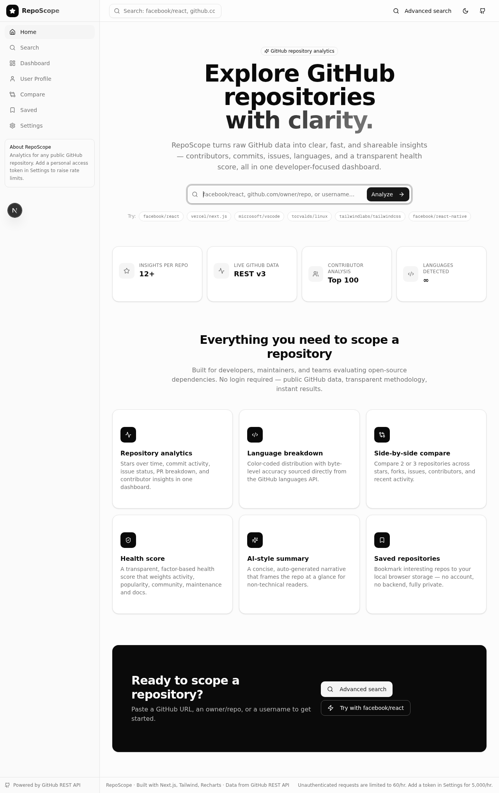
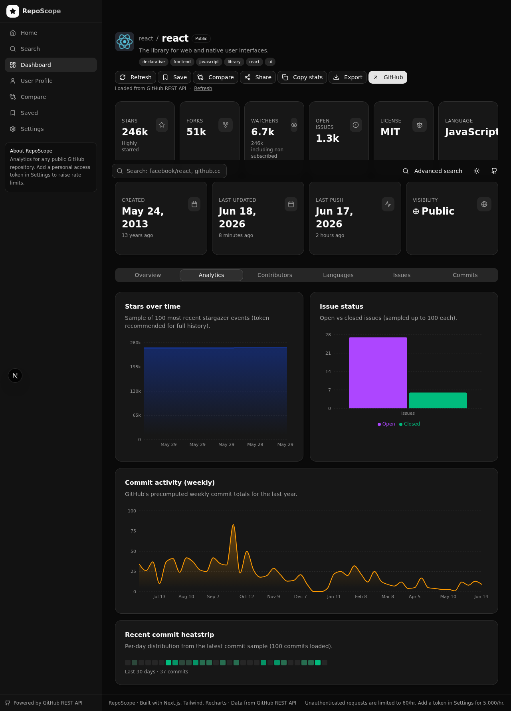

# RepoScope

**Explore GitHub repositories with clarity.**

RepoScope turns raw GitHub data into clear, fast, and shareable insights — contributors, commits, issues, languages, and a transparent health score, all in one developer-focused dashboard.

[](LICENSE)
[](https://greposcope.vercel.app)

---

## Screenshots

<table>
  <tr>
    <td></td>
    <td></td>
  </tr>
</table>

---

## Features

- **Repository analytics** — Stars over time, commit activity, issue status, PR breakdown, and contributor insights in one dashboard
- **Language breakdown** — Color-coded distribution with byte-level accuracy from the GitHub languages API
- **Trending repos** — Browse the most-starred repositories by timeframe (Today / This Week / This Month) and language
- **Side-by-side compare** — Compare 2–3 repositories across stars, forks, issues, contributors, and recent activity
- **Health score** — A transparent, factor-based score (Activity 35%, Popularity 25%, Community 15%, Maintenance 15%, Docs 10%)
- **AI-style summary** — Auto-generated narrative that frames any repo at a glance
- **Saved repositories** — Bookmark repos to local browser storage — no account, no backend, fully private

---

## Tech stack

| Layer | Technology |
|---|---|
| Framework | Next.js 16 (App Router, standalone output) |
| UI | React 19, Tailwind CSS 4, shadcn/ui, Radix UI |
| State | Zustand 5 (persisted to localStorage) |
| Data fetching | TanStack React Query 5 |
| Charts | Recharts |
| Animation | Framer Motion |
| Database | Prisma + SQLite |
| Language | TypeScript 5 |
| Runtime | Bun |

All GitHub data is fetched client-side from the public GitHub REST API (v2022-11-28). No server-side data layer beyond a placeholder API route.

---

## Getting started

**Prerequisites:** [Bun](https://bun.sh) installed.

```bash
git clone https://github.com/mlger/greposcope
cd greposcope
bun install
bun run db:push   # sync Prisma schema to SQLite
bun run dev       # http://localhost:3000
```

### GitHub token (optional)

Without a token, the GitHub API allows 60 requests/hour per IP. Add a [personal access token](https://github.com/settings/tokens) in the **Settings** view to raise this to 5,000 req/hour. No scopes are required for public repo access.

---

## Deployment

The app auto-deploys to Vercel from the `main` branch. Production URL: **[greposcope.vercel.app](https://greposcope.vercel.app)**

To deploy your own instance:

```bash
vercel deploy
```

---

## License

[MIT](LICENSE) © 2025 mlger
